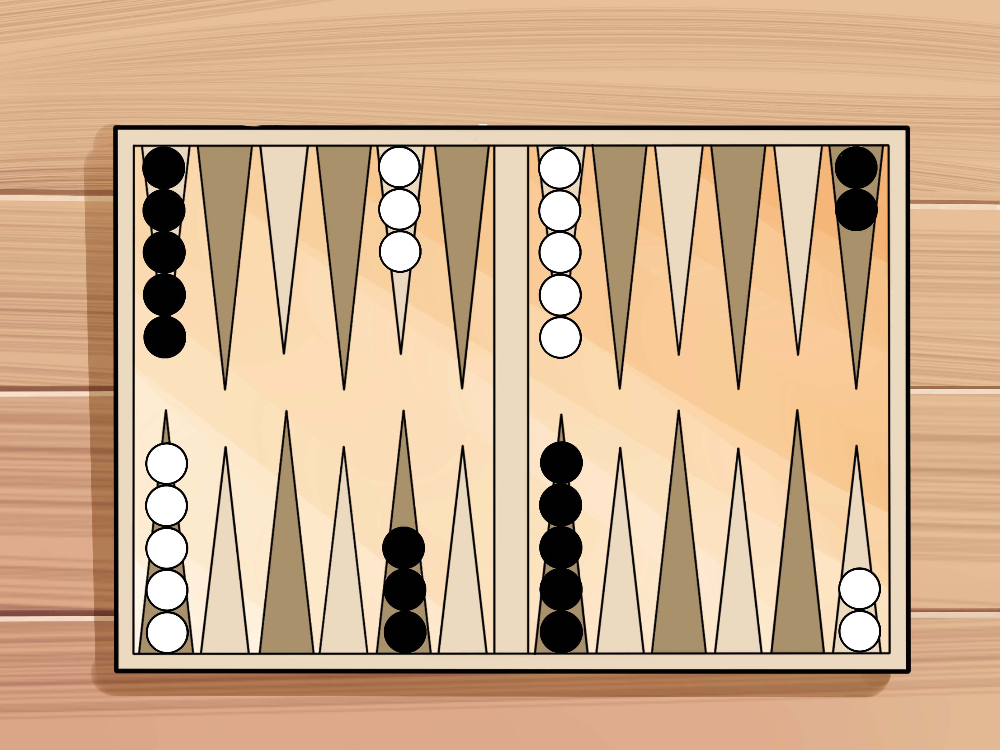

<h1 align="center">🎲 Backgammon IA — Algoritmo MinMax (Java)</h1>

  

Proyecto académico de Inteligencia Artificial que implementa el algoritmo MinMax para el juego de Backgammon utilizando Java y programación orientada a objetos.

---

## 📖 Sobre el proyecto

Este proyecto implementa una versión simplificada del juego **Backgammon** utilizando **programación orientada a objetos en Java**.

El objetivo del proyecto es desarrollar un **jugador inteligente (IA)** capaz de tomar decisiones utilizando el **algoritmo MinMax**, un algoritmo clásico utilizado en problemas de juegos dentro del campo de la Inteligencia Artificial.

El juego se modela como un **árbol de búsqueda**, donde cada nodo representa un posible estado del tablero y cada arista representa un movimiento posible.

Cuando se alcanza la profundidad máxima de búsqueda, el algoritmo evalúa el estado del tablero mediante una **función heurística** que estima qué jugador tiene ventaja en la partida.

---

## 🧠 Algoritmo de IA

El jugador IA utiliza el **algoritmo MinMax** con una profundidad de búsqueda de **dos niveles**.

Estructura conceptual del árbol de búsqueda:

MAX
├─ MIN

│  ├─ H

│  └─ H

└─ MIN

├─ H

└─ H

Donde:

* **MAX** representa el turno de la IA que intenta maximizar la puntuación
* **MIN** representa el turno del oponente que intenta minimizar la ventaja de la IA
* **H** representa la heurística del estado del tablero

El algoritmo analiza posibles movimientos futuros y selecciona la acción que conduce al mejor resultado posible asumiendo que el oponente también juega de manera óptima.

---

## 🎯 Requisitos del proyecto

La implementación incluye los siguientes componentes solicitados en el taller:

• Representación de un **estado del juego**
• Función para **generar sucesores de un estado**
• Función para determinar **si el juego ha terminado**
• **Función heurística** para evaluar los estados del tablero
• Implementación del **algoritmo MinMax** con profundidad de 2 niveles
• Una **interfaz sencilla** que permita la interacción con el jugador humano

---

## 🎲 Reglas simplificadas del juego

Para facilitar la implementación del algoritmo MinMax, el juego incluye algunas diferencias respecto al Backgammon tradicional:

• Se utiliza **un solo dado**
• El juego **no incluye apuestas**
• El objetivo es **sacar todas las fichas del tablero antes que el oponente**

Estas simplificaciones reducen la complejidad del espacio de búsqueda y permiten implementar el algoritmo de forma más manejable.

---

## 📂 Estructura del proyecto

backgammon-AI-taller4

README.md

src
└── backgammon

Main.java

Game.java

Board.java

Player.java

Move.java

Dice.java

State.java

Minimax.java

Heuristic.java

docs

images

---

## ⚙️ Tecnologías utilizadas

Java
Programación Orientada a Objetos
Algoritmo MinMax
Git

---

## 🚀 Cómo ejecutar el proyecto

Clonar el repositorio

git clone https://github.com/dgior/backgammon-AI-taller4

Entrar al directorio del proyecto

cd backgammon-AI-taller4

Compilar los archivos

javac *.java

Ejecutar el programa

java Main

---

## 👥 Contribuidores

---

## 🎓 Curso

Pontificia Universidad Javeriana

Introducción Inteligencia Artificial

Taller Calificable 4 — Juegos
